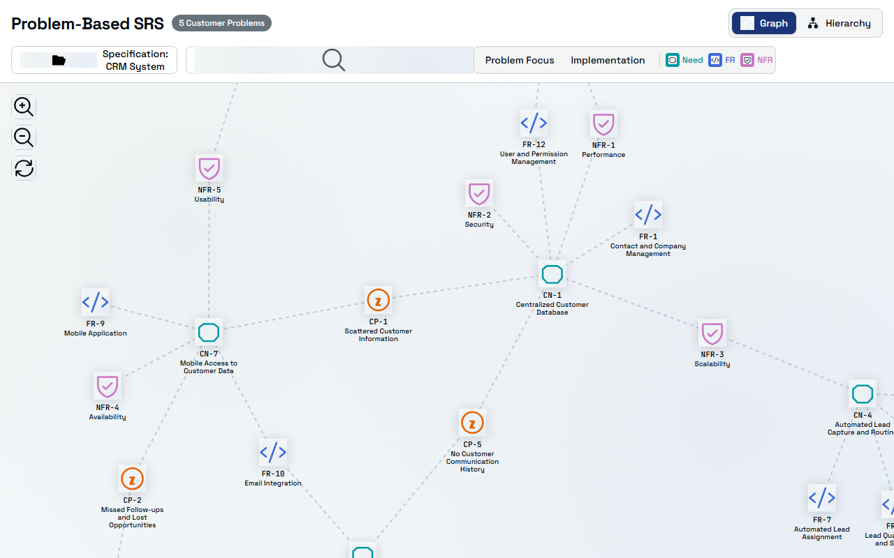
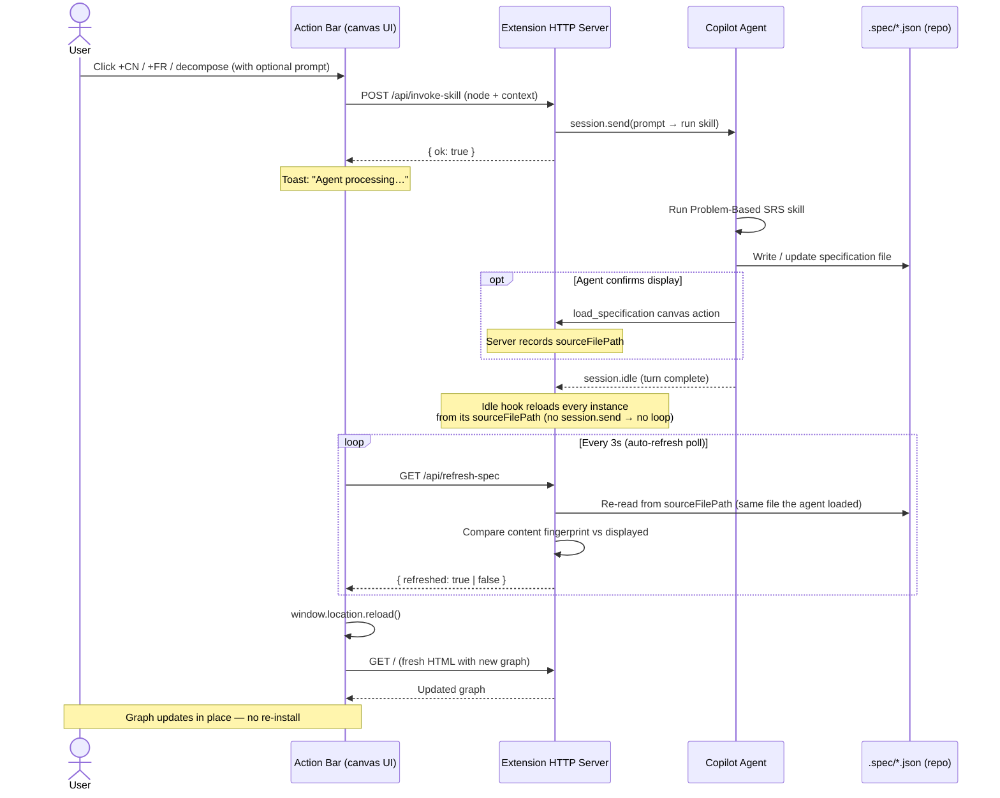
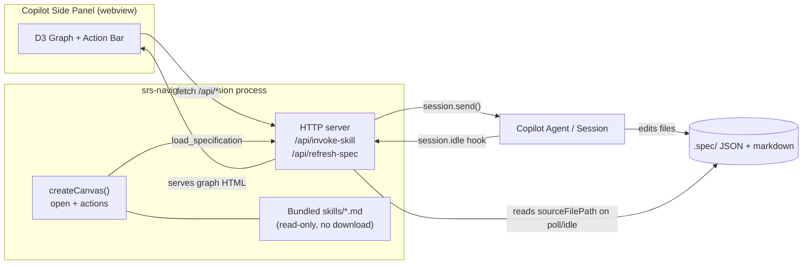

# SRS Navigator Canvas Extension

An interactive force-directed graph visualization for **Problem-Based SRS** specifications, running as a GitHub Copilot (GHCP) canvas extension.



## Features

- **Interactive D3.js graph** — Force-directed layout showing relationships between problems, needs, and requirements
- **Analysis modes** — Switch between "All", "Problem Focus" (problems + needs), and "Implementation" (needs + requirements) views
- **Search & filter** — Find nodes by ID or label text, toggle node types via the legend
- **Detail panel** — Click any node to see its full description and connections
- **Graph/Hierarchy views** — Toggle between force-directed graph and hierarchical layout
- **Zoom controls** — Zoom in/out and reset the viewport
- **Agent actions** — Load specs, validate, inspect nodes, and search programmatically

## Installation

### Method 1: Install from Gist (Recommended)

If this extension has been shared as a gist, you can install it directly in the GitHub Copilot app:

1. Open the **GitHub Copilot** app (desktop or CLI)
2. Open the **Command Palette** (Ctrl+Shift+P / Cmd+Shift+P)
3. Search for **"Install extension from gist…"**
4. Paste the gist URL when prompted
5. Choose the installation scope:
   - **Project** — installs to `.github/extensions/srs-navigator/` in your repo (shared with team)
   - **User** — installs to `~/.copilot/extensions/srs-navigator/` (personal, all projects)
   - **Session** — installs for the current session only (temporary)
6. The extension loads automatically — no restart needed

Alternatively, ask the Copilot agent directly:

```
Install the SRS Navigator extension from gist: <gist-url>
```

### Method 2: Install via `install_extension` Tool

In any Copilot CLI session, use the `install_extension` tool:

```
install_extension({ url: "<gist-url-or-repo-folder-url>", scope: "user" })
```

Supported URL formats:
- **Gist URL**: `https://gist.github.com/<user>/<gist-id>`
- **Repo folder URL**: `https://github.com/RafaelGorski/problem-based-srs-app/tree/main/.github/extensions/srs-navigator`

### Method 3: Copy into Your Repository

Copy the `.github/extensions/srs-navigator/` folder into your own repo:

```
your-repo/
└── .github/
    └── extensions/
        └── srs-navigator/
            ├── extension.mjs
            ├── copilot-extension.json
            ├── README.md
            ├── docs/
            │   └── screenshot.png
            ├── lib/
            │   ├── parser.mjs
            │   ├── validation.mjs
            │   ├── renderer.mjs
            │   └── demo-spec.mjs
            └── tests/
                ├── parser.test.mjs
                ├── validation.test.mjs
                ├── renderer.test.mjs
                └── integration.test.mjs
```

Once committed, the extension is automatically available to everyone working on the repo.

### Method 4: Share from the GHCP App

If you already have the extension installed and want to share it:

1. Open the **Command Palette** (Ctrl+Shift+P / Cmd+Shift+P)
2. Search for **"Share extension as gist…"**
3. Select **srs-navigator**
4. A private gist is created with all extension files
5. Share the gist URL with your team

Or ask the agent:

```
Share the srs-navigator extension as a gist
```

## Verifying Installation

After installing, verify the extension loaded:

1. Open a Copilot session in the project
2. The agent should list `srs-navigator` as an available canvas
3. Ask the agent: *"Open the SRS Navigator canvas"*
4. The canvas panel should appear with the demo CRM System specification

If the canvas doesn't appear, check:
- Run `extensions_manage({ operation: "list" })` to see loaded extensions
- Run `extensions_manage({ operation: "inspect", name: "srs-navigator" })` for logs

## Usage

Once installed, the canvas is available as `srs-navigator` in any Copilot CLI session.

### Opening the Canvas

Simply ask the Copilot agent:

```
Open the SRS Navigator to visualize my specification
```

Or the agent can open it programmatically:

```
open_canvas({ canvasId: "srs-navigator", instanceId: "my-srs" })
```

With a specification file:

```
open_canvas({ 
  canvasId: "srs-navigator", 
  instanceId: "my-srs",
  input: { filePath: "./path/to/spec.json" }
})
```

### Available Actions

| Action | Description |
|--------|-------------|
| `load_specification` | Load a new spec (JSON object, file path, or markdown) |
| `validate_specification` | Validate a spec against schema and reference integrity |
| `inspect_node` | Get details about a specific node by ID |
| `get_summary` | Get node/link counts for the loaded spec |
| `search_nodes` | Search nodes by ID or label text |
| `decompose_node` | Split a node into child requirements locally (no model round-trip) |

## Architecture & Agent Integration

The canvas runs as a local HTTP server (one per instance) whose page is rendered in the Copilot side panel. The **action bar** in the graph UI talks to the agent, the agent edits the specification files in the repo, and the canvas **auto-reloads** the graph when the spec changes — no re-installation or re-download of the extension is involved.

### Action bar ⇄ agent flow



### Component view



**Key design points:**

- **Content-based refresh.** `/api/refresh-spec` compares a fingerprint of the loaded graph against what the browser currently displays, so the canvas reloads on *any* spec change — not only when node/link counts differ.
- **Source-aligned refresh.** The refresh button, the auto-refresh poll, and the idle hook all reload through one helper (`reloadInstanceFromSource`) that re-reads the **same file the agent loaded** (the instance's tracked `sourceFilePath`), only falling back to a `.spec/` folder scan when no source file is known. This keeps the manual refresh button in lock-step with what `load_specification` shows.
- **Idle completion hook.** The extension listens for `session.idle`; when the agent finishes a turn it reloads every open canvas from its source so the UI reflects spec edits even if the agent never called `load_specification`. The hook never calls `session.send()`, so it cannot trigger another agent turn (no feedback loop) — the browser's 3s poll then performs the actual reload.
- **Continuous polling.** The live graph polls every 3s and reloads itself when the spec changes, whether the agent edits `.spec/` directly or calls the `load_specification` action.
- **Bundled skills.** Methodology skills ship inside the extension and are read locally. The extension does **not** download skill files at runtime, so opening the canvas never triggers an extension re-install / "downloaded" notification.

### Specification Format

The extension accepts specifications in the Problem-Based SRS JSON format:

```json
{
  "name": "My System",
  "description": "System description",
  "version": "1.0",
  "problems": [
    { "id": "CP-1", "title": "...", "description": "..." }
  ],
  "needs": [
    { "id": "CN-1", "title": "...", "description": "...", "problemIds": ["CP-1"] }
  ],
  "functionalRequirements": [
    { "id": "FR-1", "title": "...", "description": "...", "needIds": ["CN-1"] }
  ],
  "nonFunctionalRequirements": [
    { "id": "NFR-1", "title": "...", "description": "...", "needIds": ["CN-1"] }
  ]
}
```

## Testing

Run the test suite with Node.js built-in test runner:

```bash
cd .github/extensions/srs-navigator
node --test tests/parser.test.mjs tests/validation.test.mjs tests/renderer.test.mjs tests/action-bar.test.mjs tests/integration.test.mjs tests/decompose.test.mjs
```

Expected output: **125 tests passing** across the parser, validation, renderer, action-bar, integration, and decompose suites. (The Playwright-based `visual.test.mjs` runs separately via `npm run test:e2e`.)

## Requirements

- **GitHub Copilot** app (desktop) or **Copilot CLI** v1.0+
- **Node.js** v18+ (auto-provided by the Copilot runtime)
- No additional dependencies required (`@github/copilot-sdk` is auto-resolved)

## Related

- [Problem-Based SRS Methodology](https://github.com/RafaelGorski/Problem-Based-SRS)
- [Problem-Based SRS Navigator (original web app)](https://github.com/RafaelGorski/problem-based-srs-na)
